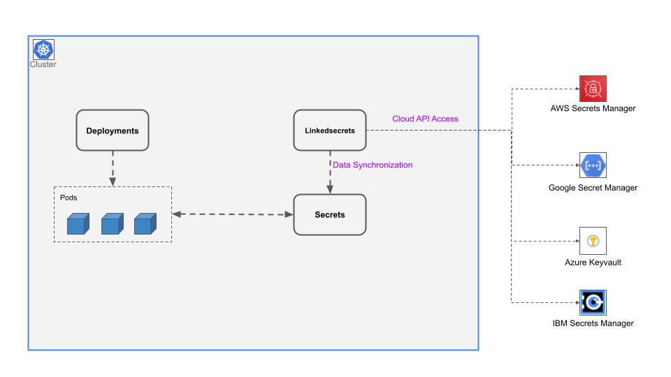
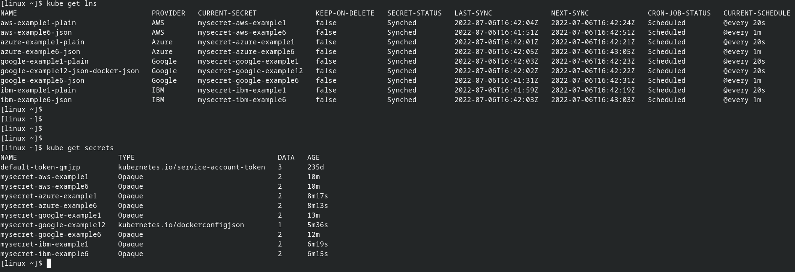
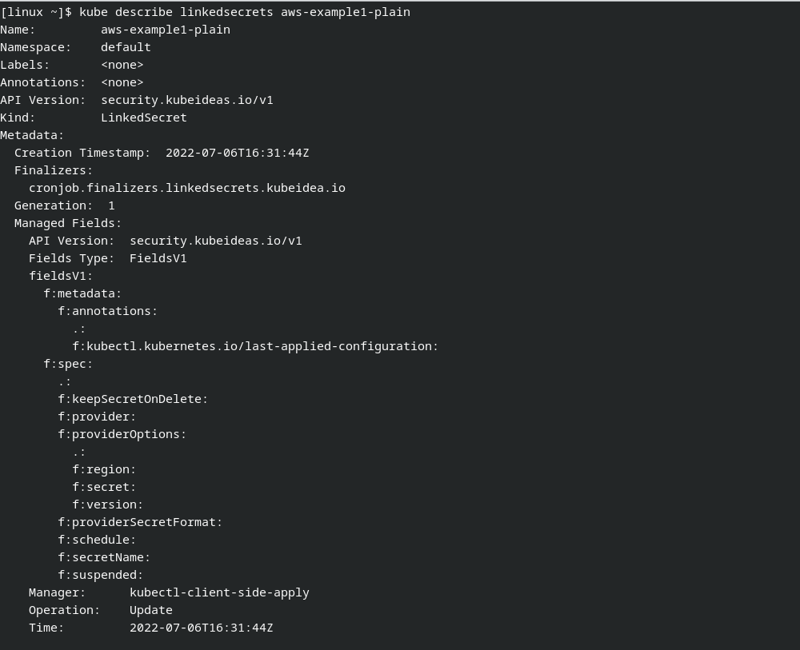
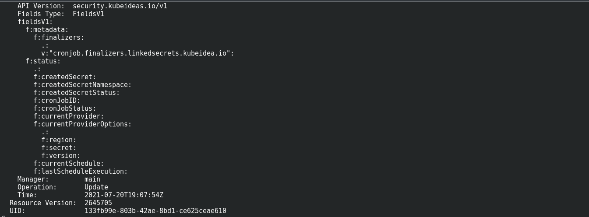
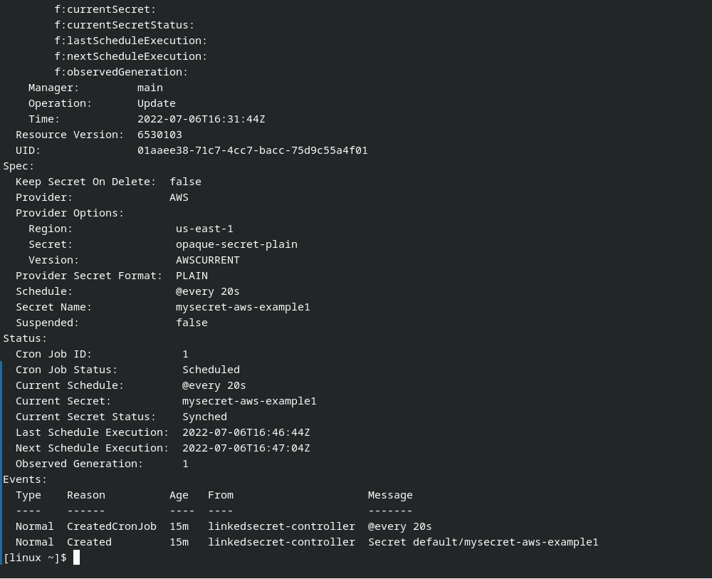

# Linkedsecrets

Linkedsecrets is a Kubernetes operator designed to synchronize kubernetes secrets with cloud secrets manager secrets.

Supported Cloud secret solutions:

* Google Secret Manager
* AWS Secret Manager
* Azure Keyvault Secrets
* IBM Secrets Manager

## Architecture

## Kubernetes Linkedsecrets Screenshots

## Installation

Click [Here](https://kubeideas.github.io/linkedsecrets/) for details and examples.
