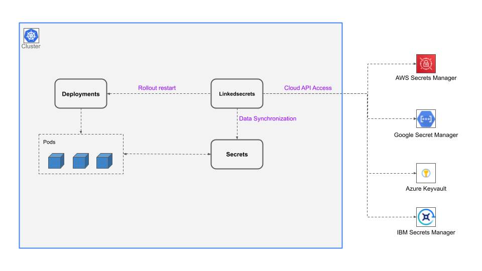
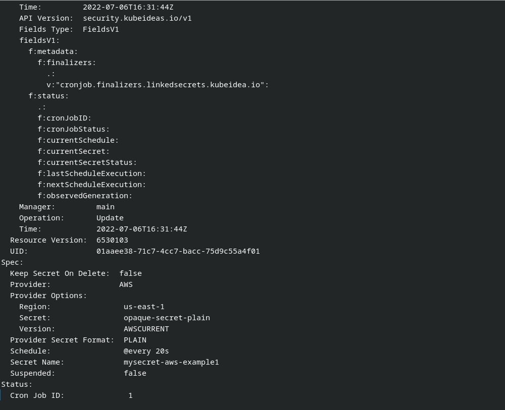

# Linkedsecrets

Linkedsecrets is a Kubernetes operator designed to synchronize data between cloud secrets manager solutions and kubernetes secrets.

Supported Cloud secret solutions:

* Google Secret Manager
* AWS Secret Manager
* Azure Keyvault Secrets
* IBM Secrets Manager

## Architecture

## Kubernetes Linkedsecrets Screenshots

## Installation

Go to [Releases](https://github.com/kubeideas/linkedsecrets/releases) and download install package with instructions and examples.
